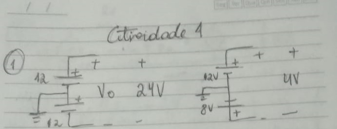
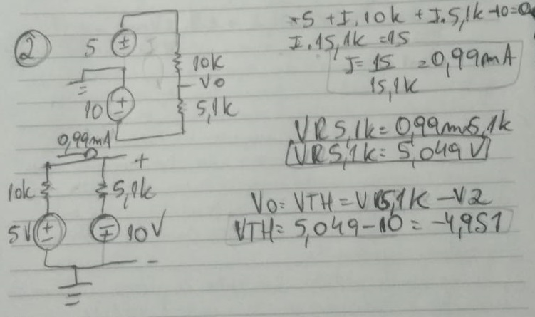
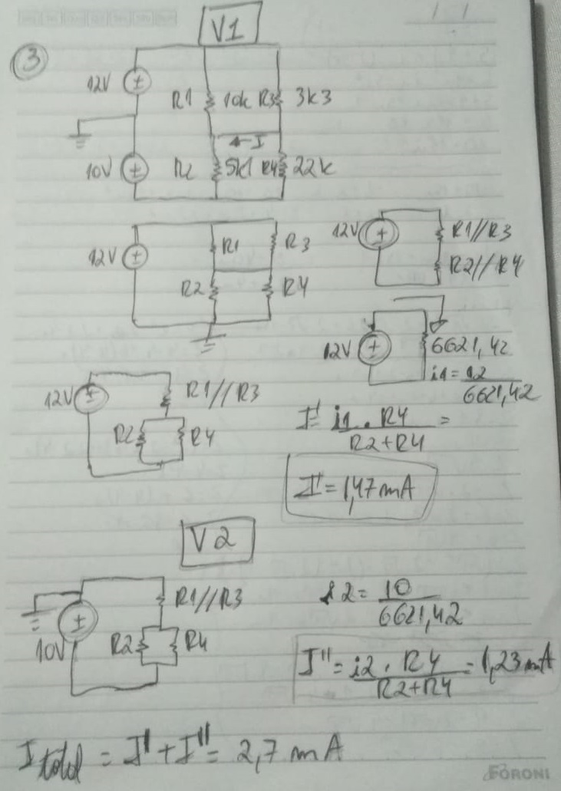
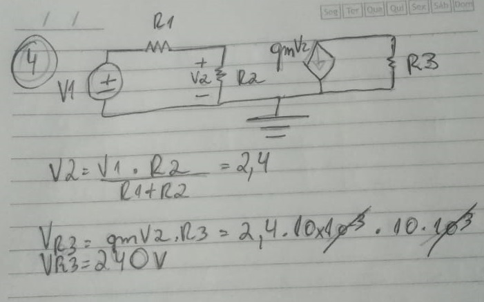
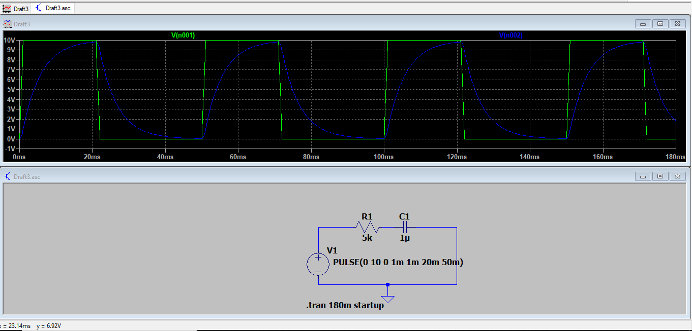
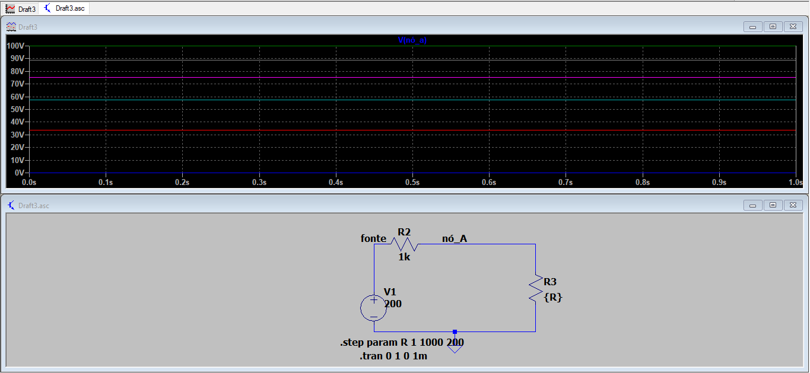
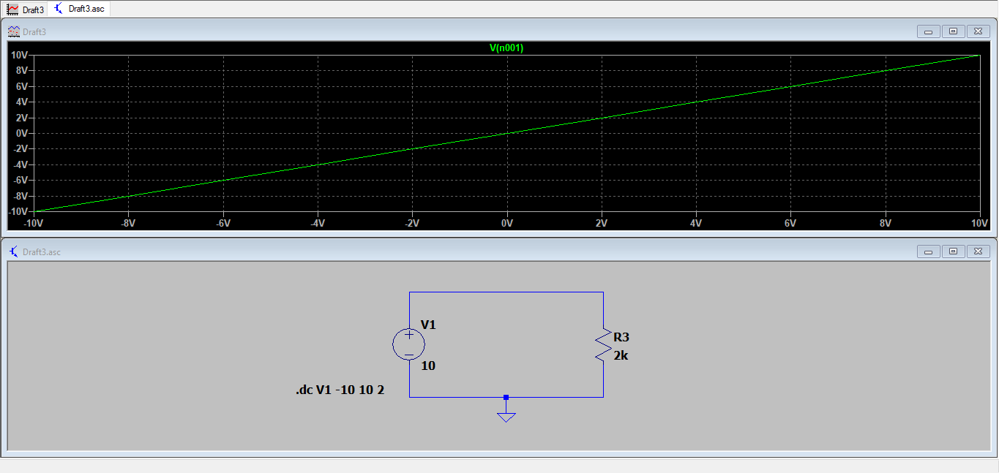
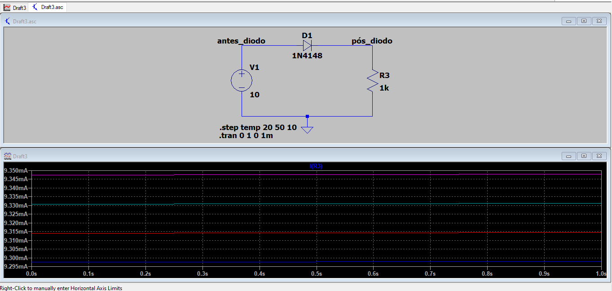

# Atividade 1
Aluno: 
* Gabriel Wagner - <gabrielstd545@gmail.com>

Professores: 
* Daniel Lohmann

## Exercício 1

Figura 1 - Exercício 1

## Exercicio 2

Para descobrirmos a tensão V0, basta encontrar a tensão em R2 e depois somar com a tensão da fonte V2.

Figura 2 - Exercício 2

## Exercício 3

Para calcularmos a corrente que passa por R2, aplicaremos o teorema da superposição.
Fazendo a série entre o paralelo de R1 e R3, e o paralelo de R2 e R4 podemos encontrar a corrente.
Depois disso basta fazer o caminho inverso separando R2 e R4, e por fim calcular a corrente através do divisor de corrente. Deste modo encontraremos a corrente para as duas fontes.

Figura 3 - Exercício 3

## Exercício 4

Para calcular a queda de tensão em R3, temos que encontrar a corrente que passa por essa malha. Para encontrar essa corrente, temos que encontrar o valor da corrente na fonte dependente.
A corrente na fonte dependente será o ganho Gm vezes a queda de tensão no resistor R2.
Para encontrarmos a queda de tensão no resistor R2 basta fazermos um divisor de tensão entre R2 e R1.

Figura 4 - Exercício 4

## Exercício 5

Neste exercício iremos montar um tutorial simples de como funciona a ferramenta SPICE.
Na primeira parte iremos falar de algumas funcionalidades do SPICE.

### Netlist
Netlist são as conexões do circuito implementado descritas em um texto.
Neste texto é destacado o nome dos componentes, sua posição entre os nós do circuito e o valor do componente.
A Ferramenta SPICE trabalha analisando o circuito através da análise de nós, e deve ser essa a maneira que você analisa o netlist.

### Label
Label net, ou etiqueta de conexões em tradução livre, são etiquetas que você pode colocar em partes do seu circuito. São muito usadas para dar nomes específicos para os nós do circuito.
Essas etiquetas são muito importantes quando seu circuito está complexo, com muitas conexões e componentes.

### Componentes básicos
Os componentes básicos do SPICE são o resistor, capacitor, indutor e diodo. Seus atalhos no teclado são respectivamente R,C,L,D.

### Subckt
Subckt, ou sub circuito, são circuitos que serão usados repetidamente, são transformados em uma espécie de caixa preta facilitando na análise dos circuitos no SPICE.
Muitos componentes de um circuito elétrico são transformados em sub circuitos. Um exemplo muito usado é o amplificador operacional.
Sub circuitos são muitos usados no SPICE quando você quer incluir modelos de componentes de empresas cujos modelos ainda não estão incluídos no seu programa SPICE.

### Incluindo novos modelos de componentes em um simulador SPICE
Existem pelo menos três maneiras de incluir novos modelos no SPICE.
A primeira é copiando todos os dados do modelo SPICE do componente e colando em uma diretiva SPICE. Não esquecendo de referenciar o modelo que você está usando na versão genérica do componente.
A segunda é usando .include ou .lib em uma diretiva SPICE, adicionando o arquivo SPICE do modelo que você baixou. É importante lembrar que se o seu arquivo do modelo SPICE não estiver na biblioteca do programa SPICE que você está usando, você deve incluir o destino do arquivo.
A terceira é criando um sub circuito. Basta você abrir o modelo SPICE dentro do programa SPICE que você está usando, procurar a palavra subckt, selecioná-la, e criar um modelo de simulação dentro do seu programa SPICE. Verifique as posições dos pinos do componente que você está usando, e use nomes sugestivos ao nomear os pinos no programa SPICE.
Por exemplo os pinos de alimentação de um ampop, use nomes como VEE e VCC, para não gerar confusão.

### Simulação .trans
A simulação .trans é usada quando você precisa fazer análise de transitórios. Segue abaixo uma fonte pulsada onde é demonstrado o carregamento e descarregamento de um capacitor.
Figura 5 - Transitório do capacitor.

### Simulação .op
Essa simulação é usada quando seu circuito não irá apresentar transitórios, quando seu circuito tende a manter o mesmo comportamento ao longo do tempo.
Figura 6 - Simulação .op.

### Simulação .step
A simulação .step serve para quando você quer variar parâmetros, como a resistência de um resistor ou a indutância de um indutor.
Segue abaixo as tensões de um resistor com resistência variável. O valor do resistor vai de 1 a 1000, com incremento de 200.
Figura 7 - Variação da resistência de um resistor através do .step param.

### Simulação .meas
A simulação .meas serve para fazer uma medida característica quando certa condição é alcançada. Por exemplo em um circuito série, medir a tensão no resistor R3 em 5 ms.

### Simulação .dc
A simulação .dc é muito parecida com a simulação .step, mas nesse caso você estará variando os parâmetros de tensão de uma fonte cc, onde só uma curva representará a mudança do parâmetro. Segue o exemplo abaixo, onde a tensão da fonte é variada de -10 V a 10 V com incremento de 2 V.
Figura 7 - Variação da tensão de uma fonte cc através do dc sweep.

### Parâmetro de variação de temperatura
Para variar a temperatura no seu programa SPICE basta adicionar a variação de parâmetro .step temp e colocar o valor inicial, final e o incremento. Segue exemplo abaixo de um circuito com diodo, componente muito sensível a temperatura. O parâmetro temperatura varia de 20 a 50 graus com incremento de 10 graus.
Figura 8 - Variação da corrente no resistor R3 devido a variação de temperatura.

Percebe-se a variação da corrente no resistor R3 devido a variação de temperatura.

